# SCK Platform AI Stack Analysis & Improvement Plan

## 🏗️ **AI Stack Architecture Overview**

```mermaid
graph TB
    %% User Interface Layer
    UI[🎨 Frontend: /rag/search] --> API[RAG API: /api/rag/search]
    
    %% API & Processing Layer
    API --> RETRIEVAL[🔍 Retrieval Engine]
    RETRIEVAL --> PREPROCESS[📝 Query Preprocessing]
    PREPROCESS --> SEARCH[🔎 Multi-Strategy Search]
    
    %% Search Strategies
    SEARCH --> VECTOR[🔤 Vector Search<br/>MiniLM-L6-v2]
    SEARCH --> LEXICAL[📚 Lexical Search<br/>Text Matching]
    SEARCH --> FRAMEWORK[🏛️ Framework-Specific<br/>GDPR/EU AI Act/NIS2/NIST/OWASP]
    SEARCH --> GENERIC[🌐 Generic Content<br/>Fallback Search]
    
    %% Data Sources
    VECTOR --> SUPABASE[(🗄️ Supabase Vector<br/>1,623 Chunks<br/>384-dim Embeddings)]
    LEXICAL --> SUPABASE
    FRAMEWORK --> SUPABASE
    GENERIC --> SUPABASE
    
    %% Data Ingestion Pipeline
    INGEST[📥 RAG Ingestion Package] --> REGULATORY[📋 Regulatory Sources]
    REGULATORY --> GDPR[🇪🇺 GDPR<br/>464 chunks]
    REGULATORY --> EUAI[🤖 EU AI Act<br/>748 chunks]
    REGULATORY --> NIS2[🛡️ NIS2 Directive<br/>365 chunks]
    REGULATORY --> NIST[🇺🇸 NIST CSF<br/>15 chunks]
    REGULATORY --> OWASP[🔒 OWASP Top 10<br/>31 chunks]
    
    %% Embedding Generation
    GDPR --> EMBED[🔤 Local Embeddings<br/>@xenova/transformers]
    EUAI --> EMBED
    NIS2 --> EMBED
    NIST --> EMBED
    OWASP --> EMBED
    EMBED --> SUPABASE
    
    %% Result Processing
    SEARCH --> RANK[📊 Result Ranking<br/>Relevance Scoring]
    RANK --> HIGHLIGHT[✨ Content Highlighting<br/>Query Matches]
    HIGHLIGHT --> RESPONSE[📤 Response Generation]
    
    %% Improvement Phases
    subgraph "🚀 Improvement Roadmap"
        PHASE1[Phase 1: Foundation<br/>Query Preprocessing<br/>Result Ranking<br/>Framework Targeting]
        PHASE2[Phase 2: Enhancement<br/>True Vector Search<br/>Query Expansion<br/>Context Awareness]
        PHASE3[Phase 3: Fine-Tuning<br/>Domain Training<br/>Prompt Engineering<br/>Multi-Modal RAG]
    end
    
    %% Current Status
    subgraph "✅ Current Status"
        STATUS1[Fixed: Retrieval System<br/>Uses Supabase Data]
        STATUS2[Working: Data Ingestion<br/>1,623 Chunks Loaded]
        STATUS3[Working: Embeddings<br/>MiniLM-L6-v2 Generated]
        STATUS4[Working: Frontend<br/>/rag/search Interface]
    end
    
    %% Styling
    classDef working fill:#90EE90,stroke:#006400,stroke-width:2px
    classDef fixed fill:#87CEEB,stroke:#000080,stroke-width:2px
    classDef planned fill:#FFE4B5,stroke:#FF8C00,stroke-width:2px
    classDef data fill:#DDA0DD,stroke:#800080,stroke-width:2px
    
    class STATUS1,STATUS2,STATUS3,STATUS4 working
    class RETRIEVAL,SEARCH fixed
    class PHASE1,PHASE2,PHASE3 planned
    class SUPABASE,GDPR,EUAI,NIS2,NIST,OWASP data
```



## 🚨 **CRITICAL ISSUE IDENTIFIED**

### **Current Problem:**
- **RAG API** was querying non-existent Prisma tables
- **Supabase data** (1,623 regulatory chunks) was completely ignored
- **Fallback to basic text search** resulted in poor results
- **No proper embedding-based retrieval** despite having professional embeddings

### **Root Cause:**
The retrieval system was designed for a different database schema and never updated to use the Supabase Vector data.

---

## 🔍 **CURRENT AI STACK ANALYSIS**

### **✅ What's Working:**
1. **Data Ingestion Pipeline**: Successfully ingests 5 regulatory frameworks
2. **Embedding Generation**: Local MiniLM-L6-v2 (384 dimensions)
3. **Supabase Vector Storage**: 1,623 chunks with metadata
4. **Frontend Interface**: `/rag/search` page ready

### **❌ What's Broken:**
1. **Retrieval Logic**: Not using Supabase data
2. **Vector Search**: Embeddings exist but not utilized
3. **Query Processing**: Basic text matching instead of semantic search
4. **Result Ranking**: No relevance scoring or ranking

### **🔄 What Just Got Fixed:**
- **Retrieval system** now uses Supabase instead of Prisma
- **Multi-strategy search** with fallbacks
- **Framework-specific targeting** for better results

---

## 🚀 **IMMEDIATE IMPROVEMENTS (Phase 1)**

### **1. Enhanced Query Processing**
```typescript
// Add query preprocessing
function preprocessQuery(query: string) {
  return {
    original: query,
    normalized: query.toLowerCase().trim(),
    keywords: extractKeywords(query),
    frameworks: detectFrameworks(query),
    intent: classifyIntent(query)
  };
}
```

### **2. Better Result Ranking**
```typescript
// Implement relevance scoring
function scoreResults(query: string, results: any[]) {
  return results.map(result => ({
    ...result,
    score: calculateRelevanceScore(query, result),
    highlights: highlightRelevantParts(query, result.content)
  })).sort((a, b) => b.score - a.score);
}
```

### **3. Framework-Aware Search**
```typescript
// Prioritize framework-specific results
const frameworkPriority = {
  'gdpr': ['data protection', 'privacy', 'consent'],
  'eu_ai_act': ['artificial intelligence', 'ai systems', 'risk'],
  'nis2': ['network security', 'cybersecurity', 'incident'],
  'nist_csf': ['cybersecurity framework', 'identify', 'protect'],
  'owasp_top10': ['web security', 'vulnerabilities', 'injection']
};
```

---

## 🎯 **ADVANCED IMPROVEMENTS (Phase 2)**

### **1. True Vector Search Implementation**
```typescript
// Generate query embeddings and use match_documents
async function vectorSearch(query: string) {
  const queryEmbedding = await generateEmbedding(query);
  
  const { data } = await supabase.rpc('match_documents', {
    query_embedding: queryEmbedding,
    match_threshold: 0.7,
    match_count: 20
  });
  
  return data;
}
```

### **2. Query Expansion & Synonyms**
```typescript
// Expand queries with regulatory terminology
const regulatorySynonyms = {
  'ai': ['artificial intelligence', 'machine learning', 'automated systems'],
  'security': ['cybersecurity', 'information security', 'data protection'],
  'compliance': ['regulatory compliance', 'governance', 'risk management']
};
```

### **3. Context-Aware Retrieval**
```typescript
// Use conversation context for better results
type SearchContext = {
  previousQueries: string[];
  selectedFrameworks: string[];
  userRole: 'compliance' | 'security' | 'legal' | 'general';
  organizationType: 'financial' | 'healthcare' | 'technology' | 'general';
};
```

---

## 🧠 **FINE-TUNING STRATEGY (Phase 3)**

### **1. Domain-Specific Fine-Tuning**
```typescript
// Fine-tune MiniLM for regulatory compliance
const fineTuningConfig = {
  baseModel: 'Xenova/all-MiniLM-L6-v2',
  trainingData: 'regulatory_compliance_corpus',
  epochs: 10,
  learningRate: 2e-5,
  batchSize: 16
};
```

### **2. Prompt Engineering for RAG**
```typescript
// Structured prompts for better RAG responses
const ragPrompts = {
  compliance: `Given the following regulatory requirements: {context}
               Answer the question: {query}
               Provide specific citations and actionable steps.`,
  
  riskAssessment: `Based on {context}, assess the risk level for: {query}
                   Include compliance gaps and mitigation strategies.`,
  
  policyDraft: `Using {context} as reference, draft a policy for: {query}
                Follow regulatory requirements and industry best practices.`
};
```

### **3. Multi-Modal RAG Enhancement**
```typescript
// Combine text, structured data, and visual elements
type RAGContext = {
  textChunks: string[];
  regulatoryTables: any[];
  complianceChecklists: any[];
  visualDiagrams: string[];
  riskMatrices: any[];
};
```

---

## 🔧 **IMPLEMENTATION ROADMAP**

### **Week 1: Foundation**
- [x] Fix retrieval system to use Supabase
- [ ] Implement query preprocessing
- [ ] Add result ranking and scoring
- [ ] Test with real regulatory queries

### **Week 2: Enhancement**
- [ ] Implement true vector search
- [ ] Add framework-specific targeting
- [ ] Implement query expansion
- [ ] Add context-aware retrieval

### **Week 3: Advanced Features**
- [ ] Implement prompt engineering
- [ ] Add conversation context
- [ ] Implement result highlighting
- [ ] Add compliance scoring

### **Week 4: Fine-Tuning**
- [ ] Prepare fine-tuning dataset
- [ ] Implement domain-specific training
- [ ] A/B test different models
- [ ] Performance optimization

---

## 📊 **SUCCESS METRICS**

### **Search Quality:**
- **Relevance Score**: >0.8 for regulatory queries
- **Framework Coverage**: All 5 frameworks returning results
- **Response Time**: <2 seconds for complex queries

### **User Experience:**
- **Query Success Rate**: >90% for natural language queries
- **Result Diversity**: Mix of frameworks, not just ISO
- **Actionability**: Results include specific compliance steps

### **Technical Performance:**
- **Vector Search Utilization**: >80% of queries use embeddings
- **Cache Hit Rate**: >70% for common regulatory terms
- **Scalability**: Handle 100+ concurrent users

---

## 🎯 **IMMEDIATE NEXT STEPS**

1. **Test the fixed retrieval system** with real queries
2. **Implement query preprocessing** for better results
3. **Add result ranking** to prioritize relevant content
4. **Plan fine-tuning strategy** for regulatory domain expertise

**The foundation is now solid - let's build the intelligent RAG system!** 🚀
